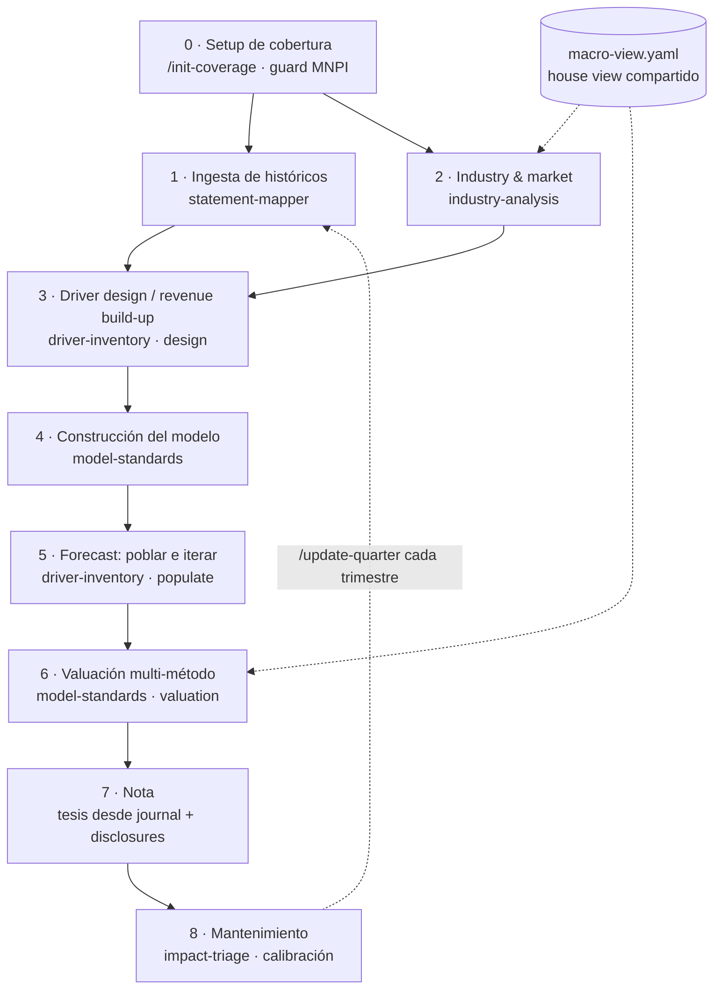

# Arquitectura — research_analyst

Documento de diseño del plugin (versión aprobada 2026-08-25). El README es la carta
de presentación; este documento es el porqué de cada decisión.

## Principios

1. **El modelo nunca calcula ni decide.** Redacta, estructura, verifica, señala.
   Cifras: fórmula de Excel o código determinista. Supuestos: del analista.
2. **Trazabilidad de 4 etiquetas** en todo artefacto: `observado` (cita de fuente y
   página) / `guidance` (afirmación de management — ni verificable ni del analista) /
   `supuesto` (del analista) / `output` (fórmula).
3. **Citas normativas exactas o `[VERIFICAR]`.** Solo `framework-mapper` emite citas.
4. **Top-down CFA:** macro → industria → compañía. Los drivers se diseñan ANTES del
   modelo; el revenue build-up define qué schedules tiene el xlsx.
5. **Debate adversarial adaptativo** en cada gate, registrado en un journal
   append-only. Es la operacionalización de Standard V(A) (diligencia) y del
   remedio conductual "devil's advocate" — el modelo desafía con lo observado,
   el analista decide.

## Flujo (9 etapas)

Cada flecha del flujo principal lleva un gate: entrevista adaptativa + debate corto
+ entrada en `thesis-journal.md` (`templates/debate-protocol.md`).

## Arquitectura comando / skill

- **Comando** = orquestador: secuencia fija de skills, gates de usuario, preflight
  obligatorio. Cero lógica propia.
- **Skill** = unidad de conocimiento: hace UNA cosa; no conoce el flujo; ninguna
  skill llama a otra (composición solo vía comandos).
- **Ownership único:** cada artefacto tiene exactamente una skill que lo escribe.
  Excepción diseñada: `thesis-journal.md` es append-only multi-skill con formato
  gobernado por el protocolo de debate.

| Artefacto | Dueña |
|---|---|
| Árbol, naming, archivado | coverage-folders |
| issuer-profile.yaml, citas normativas | framework-mapper |
| Cifras capturadas + comps/*.yaml | statement-mapper |
| industry-report.md + comp universe | industry-analysis |
| driver-map.md, assumptions, forecast-accuracy.md | driver-inventory |
| El xlsx completo | model-standards |
| Clasificación de materialidad | impact-triage |

## Decisiones de diseño y su porqué

| Decisión | Porqué |
|---|---|
| Valuación dentro de model-standards, no skill propia | La valuación es estructura del modelo base (pestañas deterministas), no un componente aparte; evita ownership doble del xlsx |
| driver-inventory en dos pasadas (design/populate) | Los drivers definen los schedules ⇒ deben existir antes del modelo; un solo dueño de assumptions evita el split |
| industry-analysis como séptima skill (enmienda al tope de 6) | Artefacto, fuentes y gate propios; meterla en driver-inventory creaba una skill-monstruo |
| Comps distribuido en 3 skills | Universo = juicio de industria; datos = músculo de extracción; tabla = fórmulas del xlsx. `comp-snapshot.yaml` es la abstracción: v2 conecta un data connector sin tocar nada más |
| macro-view como template, no skill | El view macro es del analista/casa (juicio no delegable) y es UNO por workspace, no por emisora |
| Perfil con 4 rutas de marco y derivación automática | La regulación verificada lo dicta: BMV no financiera→IFRS (2012), banco→criterios CNBV, privada→NIF, ADR→IFRS-IASB (SEC 33-8879) |
| Financieras fuera de v1 | El mapeo Anexo 33 línea por línea no está verificado; sin él, el plugin daría citas malas justo donde más importa |
| Menú de valuación con activación por perfil | Cada método es spec de pestaña (costo marginal bajo); el perfil ya existe como mecanismo; RI queda especificado-inactivo |
| Terminal dual (Gordon + exit multiple) cruzado | Mejor práctica CFA: cada terminal implica el otro; divergencia = supuesto roto detectable por fórmula |
| Reconciliación top-down↔bottom-up de revenue | Doctrina L2 (Industry & Company Analysis): dos rutas independientes; check determinista de consistencia contra industria |
| Cuarta etiqueta `guidance` | El guidance no es observable ni del analista; sin etiqueta propia contamina el contraste driver-vs-guidance |
| Registro de calibración (forecast-accuracy) | Remedio conductual CFA (feedback loops → calibración); el debate cita el sesgo documentado, no impresiones |
| Guard MNPI en preflight | Mosaic theory (Standard II(A)) protege solo con insumo público; los folders los llena el usuario |
| Disclosures obligatorios en la nota | Standard V(B) + Research Objectivity Standards: derivación, supuestos, riesgos, conflictos, certificación — nunca en letra chica |

## Multi-plataforma

Núcleo portable (skills/, commands/, templates/ en markdown) + adapters delgados:
`.claude-plugin/plugin.json` (Claude Code nativo) y `AGENTS.md` (router para
Cursor/Codex — mínimo común denominador; si ganan soporte nativo de skills, el
adapter se encoge y el núcleo no se toca).

## Base regulatoria

Deep research con verificación adversarial (2026-08-25): 25 claims, 3 votos c/u,
0 refutados. Consolidado en `skills/framework-mapper/references/ifrs-asc-nif-line-map.md`.
Huecos conocidos marcados `[VERIFICAR]` (ver README → Áreas de oportunidad).

## Estado

- v0.1.0: diseño completo + 7 skills + 3 comandos + 6 templates + adapters.
- v0.5.x (2026-08-30 → 2026-09-02): dogfood con AAPL (modelo trimestral-nativo
  v3 reproducible desde `build_model.py`, CF completo desde la capa de captura,
  19 checks F + 10 S en verde); doctrina de la auditoría completa
  (`integrity-checks.md`); builder con respiro fail-fast y `check_result`
  fechado.
- Pendiente: suite de evals; push a GitHub público; slots `filings/management/`
  y `research/sell-side/` en uso real.
